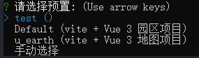

# xxv-cli

<p align="center"></p>
<p align="center">
  <a href="https://github.com/upmin-l/xxv-cli/actions/workflows/ci.yml"></a>
  <a href="https://www.npmjs.com/package/@originjs/cli"></a>
  <a href="https://nodejs.org/en/about/releases/"></a>
  <a href="https://www.npmjs.com/package/@originjs/cli"></a>
 </p>
> xxv-cli 是一个基于 [Vue3.0](https://v3.cn.vuejs.org/) 生态进行快速开发的完整系统，提供一套基于 Vue3、[thingJs](http://www.thingjs.com/guide/) 的完整 Web 项目解决方案，让开发者更加专注于业务逻辑的开发

# 特性
xxv-cli 集成实用的插件和开发工具，支持如下特性:
- [Vue3.0](https://v3.cn.vuejs.org/) & [Vite2](https://cn.vitejs.dev/)
- 通过 create 命令可创建零配置的vue3+ thingJS 原型开发  
- Jest 或者 Vitest 的 Vue 组件测试 
- 自定义预选搭配 
- 可自适应大屏、组件自动注册、全局样式文件自动引入、指定目录路由自动生成
- 一键打包部署
- uearth 主题选择
- geoJson 各类数据转换
- 在线模型加载测试 
# 图示





# 项目目录结构

```markdown
├── bin                   # node 执行文件
│   ├── index.js                # xxv 命令 执行文件
├── package
│   ├── cli-cli                 # create 命令执行
│        ├── index.js           
│   ├── cli-pinia               # pinia 模块
│        ├── index.js
│   ├── cli-spray               # spray 模块
│        ├── index.js
│   ├── cli-vue-router          # router 模块
│        ├── src                # router template
│        ├── injectUseRouter
│   ├── cli-vuex                # vuex 模块
│        ├── injectUseStore
│   ├── pluginModules           #  手动预选 依赖 模块 apply
│   ├── plugMode                # 静态文件 template
│        ├── mapThemes          # 地图主题包
│        ├── template           # 默认 template 文件
│        ├── vendor             # thingJs 静态资源
│   ├── util                    # 模块
│        ├── executeCommand          # 子进程 执行下载依赖
│        ├── generateReadme          # create 项目 README.md 文件内容生成逻辑
│        ├── getRelyVersions         # 依赖包 版本 获取
│        ├── injectImports           # 出来依赖导入语句逻辑
│        ├── PackageManager          #  包管理逻辑
│        ├── packageModules          #  手动预选依赖注入
│        ├── rcPath                  #  负责处理路径模块
│        ├── sortObject              #  包顺序
│        ├── writeFileTree            #  负责文件写入
│   ├── create                  # xxv 项目创建create 命令入口
│   ├── Creator                 #  命令交互逻辑，依赖入口收集逻辑
│   ├── GeneratorAPI            # 各种模板生成 核心逻辑
│   ├── options                 # 本地存储预设逻辑及默认渲染初始定义
│   ├── ResolveMultistage       # 处理问答 工厂函数
│   ├── SetupTemplate           #  执行依赖各个插件内部逻辑，语句的导入及最终模板的生成
│   ├── utils                   # 公共方法
```

